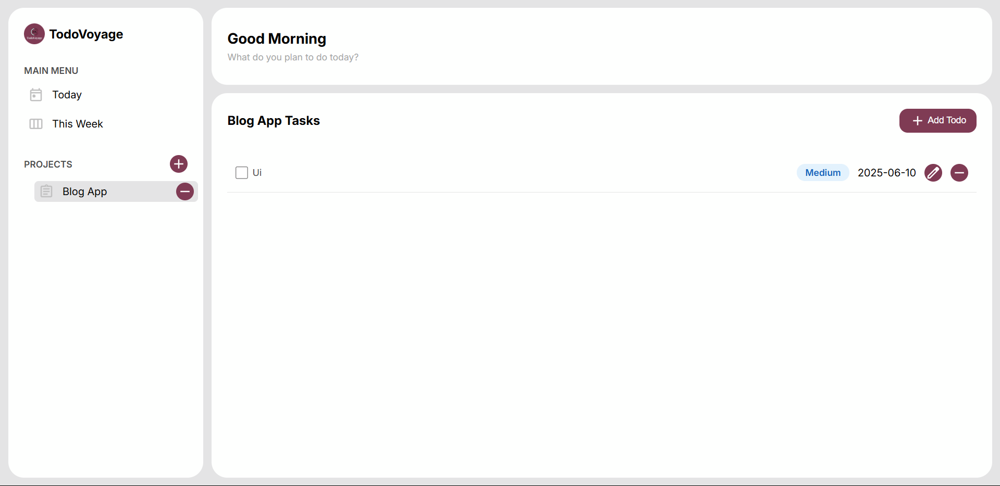

# TodoVoyage - Your Ultimate Todo List App

Welcome to **TodoVoyage**, a powerful and stylish todo list application built with modern JavaScript! Conquer your tasks with ease using projects, priority-based coloring, and seamless persistence.

## 🎉 About the Project

TodoVoyage is a single-page web app designed to help you organize your life. Whether it’s work deadlines or personal goals, this app lets you create projects, manage todos with details like due dates and priorities, and keep everything saved locally. Built with a modular architecture, it’s a showcase of clean code and user-friendly design.

## 🚀 Features

- **Projects**: Organize todos into customizable projects, with a default project to start.
- **Todos**: Add, edit, delete, and mark todos as complete, with fields for title, description, due date, and priority.
- **Priority Colors**: Visually distinguish tasks with color-coded priorities (low, medium, high).
- **Persistence**: Data saved using the Web Storage API (`localStorage`)—your tasks stay safe across refreshes.
- **Modular Design**: Separated into Models, Storage, Controller, and View for maintainable code.
- **Responsive UI**: Clean and intuitive interface inspired by top todo apps like Todoist and Things.

## 🌐 Demo

Check out TodoVoyage in action! [Click here to view the demo](https://mohamedmosilhy.github.io/Todo-List/).

## 🛠️ Tech Stack

- **HTML5**: For the app’s structure.
- **CSS3**: For styling with priority-based colors.
- **JavaScript (ES6+)**: Core logic with modular classes.
- **Webpack**: For bundling and optimizing the app.
- **date-fns**: For elegant date formatting (optional, if included).
- **localStorage**: For persistent data storage.

## 📸 Screenshots



## 🔧 Getting Started

### Prerequisites

- Node.js and npm installed (check with `node -v` and `npm -v`).
- A modern web browser (Chrome, Firefox, etc.).

### Installation

1. Clone the repository:

   ```bash
   git clone https://github.com/mohamedmosilhy/Todo-List.git
   cd TodoVoyage
   ```

2. Install dependencies:

   ```bash
   npm install
   ```

3. Build the project:

   ```bash
   npm run build
   ```

4. Start the app:
   - Open `dist/index.html` in your browser, or set up a local server (e.g., `npx serve`) if needed.

### Usage

- Create a new project via the sidebar.
- Add todos with titles, descriptions, due dates, and priorities.
- Toggle todo completion or delete them as needed.
- Switch projects to organize your tasks!

## 🛠️ Development

### Folder Structure

```
TodoVoyage/
├── src/
│   ├── js/           # JavaScript modules (models, storage, controller, view, main)
│   ├── css/          # Stylesheets
│   └── index.html    # Main HTML file
├── assets/           # Static files (e.g., images)
├── package.json      # Project config
├── webpack.config.js # Build configuration
└── README.md         # This file
```

### Scripts

- `npm run build`: Bundles the app with Webpack.
- `npm run dev`: (Optional) Starts a development server (configure if desired).

## 📄 License

This project is licensed under the MIT License - see the [LICENSE](LICENSE) file for details.

## 🌟 Star This Repo

If you find TodoVoyage helpful, please star the repo! It motivates me to keep improving.

Happy task-tackling! 🚀  
_Created with ❤️ by Mohamed Mosilhy_
